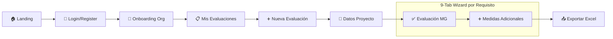

# 🤖 IA Sandbox — Sistema de Preevaluación AESIA

<p align="center">
  
  
  
  
  
</p>

Sistema de **autodiagnóstico de cumplimiento** para el **Sandbox de Inteligencia Artificial de España (AESIA)**. Permite a organizaciones evaluar el nivel de madurez de sus sistemas de IA según la normativa europea (RIA - Reglamento de IA) y las 12 guías AESIA, generando informes profesionales para presentar al regulador.

---

## 📋 Tabla de Contenidos

- [Características](#-características)
- [Arquitectura](#-arquitectura)
- [Requisitos](#-requisitos)
- [Instalación Rápida](#-instalación-rápida)
- [Configuración](#-configuración)
- [Estructura del Proyecto](#-estructura-del-proyecto)
- [Base de Datos](#-base-de-datos)
- [API Reference](#-api-reference)
- [Flujo de Evaluación](#-flujo-de-evaluación)
- [Regla Guía 16 AESIA](#-regla-guía-16-aesia)
- [Tests](#-tests)
- [Metodología](#-metodología)
- [Licencia](#-licencia)

---

## ✨ Características

### Funcionalidades Core

| Característica | Descripción |
|----------------|-------------|
| **12 Requisitos RIA** | Evaluación completa de Arts. 6-25 del Reglamento de IA |
| **84 Medidas Guía (MG)** | Catálogo oficial AESIA preinformado automáticamente |
| **8 Niveles de Madurez** | Escala L1-L8 con cálculo automático de plan de adaptación |
| **Medidas Adicionales (MA)** | Medidas personalizadas con relación N:M a subapartados |
| **Exportación Excel** | Inyección en templates oficiales AESIA (9 pestañas) |
| **Multi-tenant** | Aislamiento por organización con RLS |

### Automatizaciones

- ✅ **Preseed automático**: Las evaluaciones se preinforman desde el catálogo
- ✅ **Triggers de base de datos**: `diagnosis_status` y `adaptation_plan` calculados en DB
- ✅ **Auto-save**: Guardado automático con debounce en frontend
- ✅ **Storage seguro**: RLS en bucket `ma-documents` para evidencias

---

## 🏗️ Arquitectura

```
┌─────────────────────────────────────────────────────────────────┐
│                     FRONTEND (Next.js 14)                       │
│  ┌───────────┐ ┌─────────────────┐ ┌─────────────────────────┐ │
│  │ Landing   │ │ 9-Tab Wizard    │ │ Dashboard               │ │
│  │ /         │ │ /evaluacion     │ │ /mis-evaluaciones       │ │
│  └───────────┘ └─────────────────┘ └─────────────────────────┘ │
│                        │                                        │
│  ┌─────────────────────┴──────────────────────────────────────┐│
│  │                lib/supabase.ts (RPC + CRUD)                ││
│  └────────────────────────────────────────────────────────────┘│
└────────────────────────────┬────────────────────────────────────┘
                             │
┌────────────────────────────┼────────────────────────────────────┐
│                    SUPABASE (PostgreSQL)                        │
│  ┌──────────────────────────────────────────────────────────┐  │
│  │ MASTER TABLES         │ TRANSACTIONAL TABLES             │  │
│  │ ───────────────────── │ ──────────────────────────────── │  │
│  │ master_requirements   │ applications                     │  │
│  │ master_measures       │ assessments_mg (+ trigger)       │  │
│  │ master_article_subparts│ measures_additional             │  │
│  │ master_mg_to_subpart  │ rel_ma_subparts                  │  │
│  │                       │ assessments_ma                   │  │
│  └──────────────────────────────────────────────────────────┘  │
│  ┌──────────────────────────────────────────────────────────┐  │
│  │ RPC: preseed_assessments_mg()  │  Storage: ma-documents  │  │
│  └──────────────────────────────────────────────────────────┘  │
└────────────────────────────┬────────────────────────────────────┘
                             │
┌────────────────────────────┼────────────────────────────────────┐
│                    BACKEND (FastAPI)                            │
│  ┌─────────────────────┐ ┌──────────────────────────────────┐  │
│  │ /export/single/{id} │ │ /export/full                     │  │
│  │ Template Injection  │ │ ZIP con 12 XLS                   │  │
│  └─────────────────────┘ └──────────────────────────────────┘  │
│  ┌──────────────────────────────────────────────────────────┐  │
│  │ excel_engine/: TemplateFiller (openpyxl)                 │  │
│  └──────────────────────────────────────────────────────────┘  │
└─────────────────────────────────────────────────────────────────┘
```

---

## 📦 Requisitos

| Herramienta | Versión Mínima |
|-------------|----------------|
| Node.js | 18+ |
| Python | 3.9+ |
| npm/pnpm | 8+ |
| Supabase | Cuenta activa (EU region) |

---

## 🚀 Instalación Rápida

### 1. Clonar y configurar

```bash
# Clonar repositorio
git clone <repo-url>
cd molten-armstrong

# Configurar variables de entorno
cp src/frontend/.env.example src/frontend/.env.local
cp src/backend/.env.example src/backend/.env
# Editar con tus credenciales Supabase
```

### 2. Frontend (Next.js)

```bash
cd src/frontend
npm install
npm run dev
# → http://localhost:3000
```

### 3. Backend (FastAPI)

```bash
cd src/backend
pip install -r requirements.txt
uvicorn main:app --reload
# → http://localhost:8000
# → Swagger: http://localhost:8000/docs
```

### 4. Base de Datos

```bash
# Ejecutar todas las migraciones
psql $DATABASE_URL -f src/migrations/FULL_MIGRATION.sql

# O ejecutar individualmente (001-013)
for f in src/migrations/0*.sql; do psql $DATABASE_URL -f "$f"; done
```

---

## ⚙️ Configuración

### Frontend (`src/frontend/.env.local`)

```env
NEXT_PUBLIC_SUPABASE_URL=https://rlisgwhdafgnmbauzynr.supabase.co
NEXT_PUBLIC_SUPABASE_ANON_KEY=sb_publishable_pRh7ZcTrUJOTvpbYehynFg_igrmE4tx
NEXT_PUBLIC_API_URL=http://localhost:8000
```

### Backend (`src/backend/.env`)

```env
SUPABASE_URL=https://rlisgwhdafgnmbauzynr.supabase.co
SUPABASE_SERVICE_KEY=sb_secret_XeNB-FIVRGb_EOL_Da-Cyg_LRs5RQc5
OPENAI_API_KEY=sk-...
ENVIRONMENT=development
```

> ⚠️ **IMPORTANTE**: La `SECRET` key solo debe usarse en backend. La `PUBLISHABLE` key es segura para frontend con RLS habilitado.

---

## 📁 Estructura del Proyecto

```
molten-armstrong/
├── README.md                    # Este archivo
├── usecase_manifest.yaml        # Contrato AL-SDLC
│
├── src/
│   ├── frontend/                # Next.js 14 (App Router)
│   │   ├── app/
│   │   │   ├── page.tsx         # Landing
│   │   │   ├── auth/            # Login/Register
│   │   │   ├── onboarding/      # Setup organización
│   │   │   ├── evaluacion/      # 9-Tab Wizard por requisito
│   │   │   ├── mis-evaluaciones/# Dashboard
│   │   │   └── medidas-adicionales/
│   │   ├── components/
│   │   │   ├── MaturitySelector.tsx
│   │   │   ├── AssessmentGrid.tsx
│   │   │   └── ExportButton.tsx
│   │   ├── lib/
│   │   │   └── supabase.ts      # Cliente, CRUD, RPCs
│   │   └── styles/
│   │       └── globals.css      # Tokens Garrigues
│   │
│   ├── backend/                 # FastAPI
│   │   ├── main.py              # App + endpoints
│   │   ├── services/
│   │   │   └── conversion_logic.py  # Regla L→Plan
│   │   ├── excel_engine/
│   │   │   ├── generator.py     # Generador básico
│   │   │   ├── template_filler.py   # Inyección en templates
│   │   │   └── export_api.py    # Router /export
│   │   └── templates/           # XLS oficiales AESIA
│   │
│   └── migrations/              # SQL (Supabase)
│       ├── 001_master_tables.sqlÅ
│       ├── ...
│       ├── 011_guia16_p0_backbone.sql  # Preseed RPC + triggers
│       ├── 012_seed_all_mg_mappings.sql # 84 MG measures
│       ├── 013_storage_rls_policies.sql
│       └── FULL_MIGRATION.sql   # Consolidado
│
├── spec/                        # Especificaciones
│   ├── domain_model.md
│   ├── database_schema.md
│   ├── workflow_states.md
│   └── agent_contracts/         # JSON Schemas
│
├── evals/                       # Quality Gates
│   ├── datasets/
│   └── smoke_tests/
│       └── catalog_smoke_tests.sql  # Verificación catálogo
│
├── ops/                         # Operaciones
│   └── runbook.md               # Credenciales + troubleshooting
│
└── docs/                        # Documentación extendida
```

---

## 🗄️ Base de Datos

### Tablas Maestras (Catálogo AESIA)

| Tabla | Descripción | Registros |
|-------|-------------|-----------|
| `master_requirements` | 12 requisitos del RIA | 12 |
| `master_measures` | Medidas Guía (MG) | 84 |
| `master_article_subparts` | Subapartados de artículos | ~80+ |
| `master_mg_to_subpart` | Mapping MG ↔ Subpart | 84 |

### Tablas Transaccionales

| Tabla | Descripción |
|-------|-------------|
| `applications` | Cabecera de evaluación |
| `assessments_mg` | Evaluaciones MG (con trigger) |
| `measures_additional` | Medidas personalizadas |
| `rel_ma_subparts` | Relación MA ↔ Subparts |
| `assessments_ma` | Evaluaciones MA |
| `organizations` | Multi-tenancy |
| `org_members` | Membresías |

### Funciones y Triggers

```sql
-- RPC: Preinforma assessments desde catálogo
preseed_assessments_mg(application_id, requirement_code, version)

-- Trigger: Calcula diagnosis_status + adaptation_plan
trg_assessments_mg_derive → derive_diagnosis_and_plan()
```

---

## 🔌 API Reference

### Endpoints Principales

| Método | Endpoint | Descripción |
|--------|----------|-------------|
| `GET` | `/` | Health check |
| `GET` | `/health` | Status |
| `POST` | `/export/single/{code}` | Exporta checklist individual |
| `POST` | `/export/full` | Exporta ZIP con 12 checklists |
| `GET` | `/export/templates` | Lista templates disponibles |
| `GET` | `/api/requirements` | Lista 12 requisitos |
| `GET` | `/api/maturity-levels` | Lista niveles L1-L8 |

### Ejemplo: Exportar Requisito

```bash
curl -X POST http://localhost:8000/export/single/TRANSPARENCY \
  -H "Content-Type: application/json" \
  -d '{
    "requirement_code": "TRANSPARENCY",
    "assessments_mg": [
      {"mg_id": "MG_TRANS_01", "subpart_id": "13.1", "difficulty": "01", "maturity": "L3"}
    ]
  }' \
  --output transparency_checklist.xlsx
```

---

## 📊 Flujo de Evaluación



### Pasos del Wizard (por requisito)

1. **Artículo RIA** — Contexto legal (solo lectura)
2. **Medidas Guías (MG)** — Catálogo oficial
3. **Relación MG-Apart.** — Matriz visual
4. **Autoeval MG** — ⭐ Formulario principal (difficulty + maturity)
5. **Medidas Adicionales** — Definir MA personalizadas
6. **Relación MA-Apart.** — Vincular MA a subapartados
7. **Autoeval MA** — Evaluar MA
8. **Resumen** — Vista consolidada
9. **Exportar** — Descargar XLS

---

## 📐 Regla Guía 16 AESIA

El **plan de adaptación** se calcula automáticamente desde el **nivel de madurez**:

| Nivel | Descripción (Manual AESIA) | Plan | Acción |
|-------|---------------------------|------|--------|
| **L1** | No documentada ni implementada | `01` | Documentar e Implementar |
| **L2** | Documentación en curso, no implementada | `01` | Documentar e Implementar |
| **L3** | Documentada, no implementada | `02` | Implementar |
| **L4** | Documentada, implementación en curso | `02` | Implementar |
| **L5** | Documentada e implementada | `03` | Adaptación Completa |
| **L6** | No documentada e implementada | `04` | Documentar |
| **L7** | Documentación en curso e implementada | `04` | Documentar |
| **L8** | **Medida no necesaria para el sistema** | `05` | Ninguna acción |

> ⚠️ **L8 requiere justificación**: Cuando se selecciona L8, debe explicarse por qué la medida no aplica al sistema evaluado.

**Implementación en DB**:
```sql
CREATE TRIGGER trg_assessments_mg_derive
BEFORE INSERT OR UPDATE OF maturity ON assessments_mg
FOR EACH ROW EXECUTE FUNCTION derive_diagnosis_and_plan();
```

---

## 🧪 Tests

### Smoke Tests (Catálogo)

```bash
# Verificar integridad del catálogo
psql $DATABASE_URL -f evals/smoke_tests/catalog_smoke_tests.sql
```

Tests incluidos:
- ✅ 12 requisitos existen
- ✅ 84 medidas MG existen
- ✅ 84 mappings MG↔subpart
- ✅ Sin MG IDs huérfanos
- ✅ RPC preseed existe
- ✅ Trigger derive existe
- ✅ RISK_MGMT → Art. 9

---

## 🎨 Diseño

### Tokens Garrigues

| Token | Valor |
|-------|-------|
| **Primary** | `#004438` (PANTONE 3308 C) |
| **Success** | `#009A77` |
| **Font UI** | Montserrat |
| **Font Docs** | Arial |

---

## 📋 Metodología

Proyecto desarrollado siguiendo **AL-SDLC v1.2** (Agentic Legal Software Delivery Lifecycle):

- ✅ **Spec-Driven Development** — `spec/` como fuente de verdad
- ✅ **Agent Contracts** — JSON Schemas para validación
- ✅ **Quality Gates** — Smoke tests automatizados
- ✅ **Compliance by Design** — RLS, triggers, constraints

---

## 🔐 Seguridad

| Capa | Implementación |
|------|----------------|
| **Autenticación** | Supabase Auth |
| **Autorización** | Row Level Security (RLS) |
| **Multi-tenant** | Aislamiento por `org_id` |
| **Storage** | RLS en bucket `ma-documents` |
| **API** | SERVICE_KEY solo en backend |

> ⚠️ Este es un **POC/Demostrador**. Para producción, revisar hardening adicional.

---

## 📞 URLs del Sistema

| Servicio | URL |
|----------|-----|
| Frontend | http://localhost:3000 |
| Backend API | http://localhost:8000 |
| Swagger Docs | http://localhost:8000/docs |
| Supabase Dashboard | https://supabase.com/dashboard/project/rlisgwhdafgnmbauzynr |

---

## 📄 Licencia

Proyecto propietario. Todos los derechos reservados.

---

<p align="center">
  Desarrollado con ❤️ para el <strong>Sandbox de IA de España</strong>
</p>
