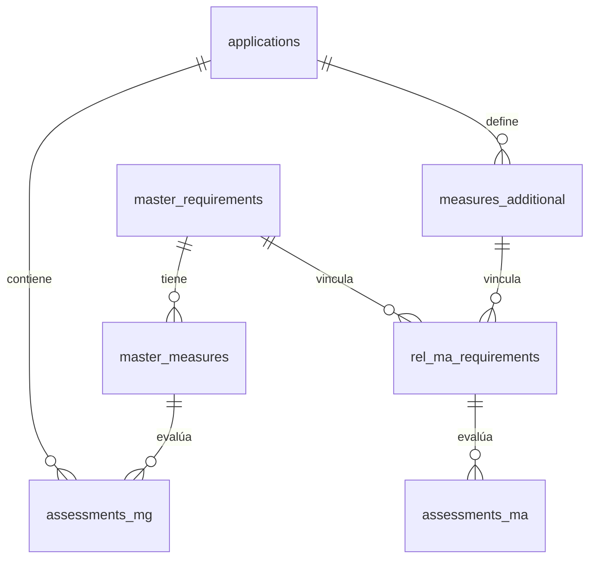

# Database Schema - Supabase/PostgreSQL

## Diagrama ER



## Tablas

### master_requirements
| Columna | Tipo | Constraints |
|---------|------|-------------|
| id | TEXT | PRIMARY KEY |
| article_ref | TEXT | NOT NULL |
| title | TEXT | NOT NULL |
| description | TEXT | |
| created_at | TIMESTAMPTZ | DEFAULT NOW() |

### master_measures
| Columna | Tipo | Constraints |
|---------|------|-------------|
| id | TEXT | PRIMARY KEY |
| requirement_id | TEXT | FK → master_requirements |
| guide_ref | TEXT | |
| description | TEXT | NOT NULL |
| created_at | TIMESTAMPTZ | DEFAULT NOW() |

### applications
| Columna | Tipo | Constraints |
|---------|------|-------------|
| id | UUID | PRIMARY KEY |
| user_id | UUID | FK → auth.users |
| project_metadata | JSONB | DEFAULT '{}' |
| risk_profile | JSONB | DEFAULT '{}' |
| status | TEXT | CHECK IN ('DRAFT','IN_PROGRESS','COMPLETED','EXPORTED') |
| created_at | TIMESTAMPTZ | DEFAULT NOW() |
| updated_at | TIMESTAMPTZ | DEFAULT NOW() |

### assessments_mg
| Columna | Tipo | Constraints |
|---------|------|-------------|
| application_id | UUID | FK → applications, PK |
| measure_id | TEXT | FK → master_measures, PK |
| difficulty | TEXT | CHECK IN ('00','01','02') |
| maturity | TEXT | CHECK IN ('L1'..'L8') |
| diagnosis_status | TEXT | DEFAULT '00' |
| adaptation_plan | TEXT | |
| updated_at | TIMESTAMPTZ | DEFAULT NOW() |

### measures_additional
| Columna | Tipo | Constraints |
|---------|------|-------------|
| id | UUID | PRIMARY KEY |
| application_id | UUID | FK → applications |
| title | TEXT | NOT NULL |
| description | TEXT | |
| attachment_url | TEXT | |
| doc_provided | BOOLEAN | GENERATED |
| sedia_status | TEXT | DEFAULT '00' |
| sedia_comments | TEXT | |
| created_at | TIMESTAMPTZ | DEFAULT NOW() |

### rel_ma_requirements
| Columna | Tipo | Constraints |
|---------|------|-------------|
| measure_additional_id | UUID | FK → measures_additional, PK |
| requirement_id | TEXT | FK → master_requirements, PK |

### assessments_ma
| Columna | Tipo | Constraints |
|---------|------|-------------|
| measure_additional_id | UUID | FK (compuesta), PK |
| requirement_id | TEXT | FK (compuesta), PK |
| difficulty | TEXT | |
| maturity | TEXT | |
| diagnosis_status | TEXT | |
| adaptation_plan | TEXT | |
| updated_at | TIMESTAMPTZ | DEFAULT NOW() |

## Índices

```sql
CREATE INDEX idx_measures_requirement ON master_measures(requirement_id);
CREATE INDEX idx_applications_user ON applications(user_id);
CREATE INDEX idx_applications_status ON applications(status);
CREATE INDEX idx_assessments_application ON assessments_mg(application_id);
CREATE INDEX idx_ma_application ON measures_additional(application_id);
```
