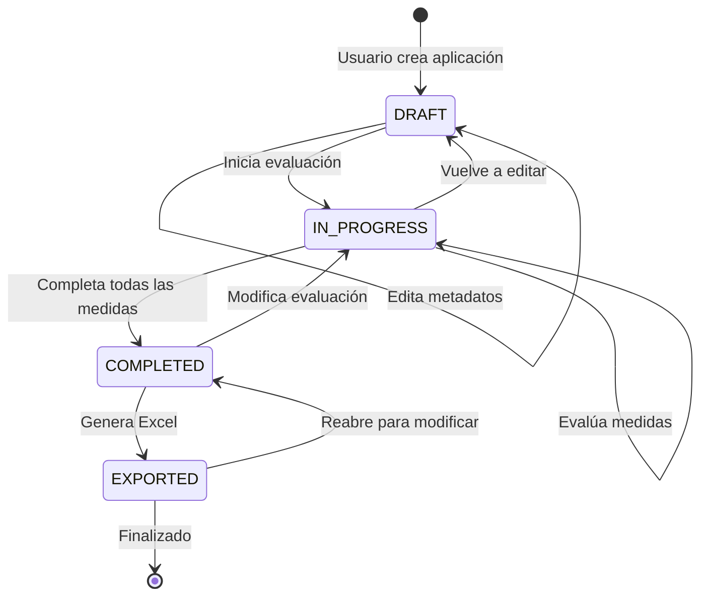

# Máquina de Estados - Workflow de Aplicación

## Estados de Aplicación

## Transiciones

| Origen | Destino | Trigger | Validación |
|--------|---------|---------|------------|
| [*] | DRAFT | `POST /applications` | user_id válido |
| DRAFT | IN_PROGRESS | `PUT /applications/:id/start` | metadata completa |
| IN_PROGRESS | COMPLETED | `PUT /applications/:id/complete` | todas MG evaluadas |
| COMPLETED | EXPORTED | `POST /applications/:id/export` | Gatekeeper PASS |

## Eventos

- `application.created` - Nueva aplicación creada
- `application.started` - Evaluación iniciada
- `assessment.updated` - Medida evaluada
- `application.completed` - Evaluación completada
- `application.exported` - Excel generado

## Gatekeeper (Pre-Export)

Antes de transición COMPLETED → EXPORTED:

1. ✅ Todas las MAs vinculadas a ≥1 requisito
2. ✅ URLs de adjuntos válidas
3. ✅ No hay MGs pendientes (`diagnosis_status != '00'`)
